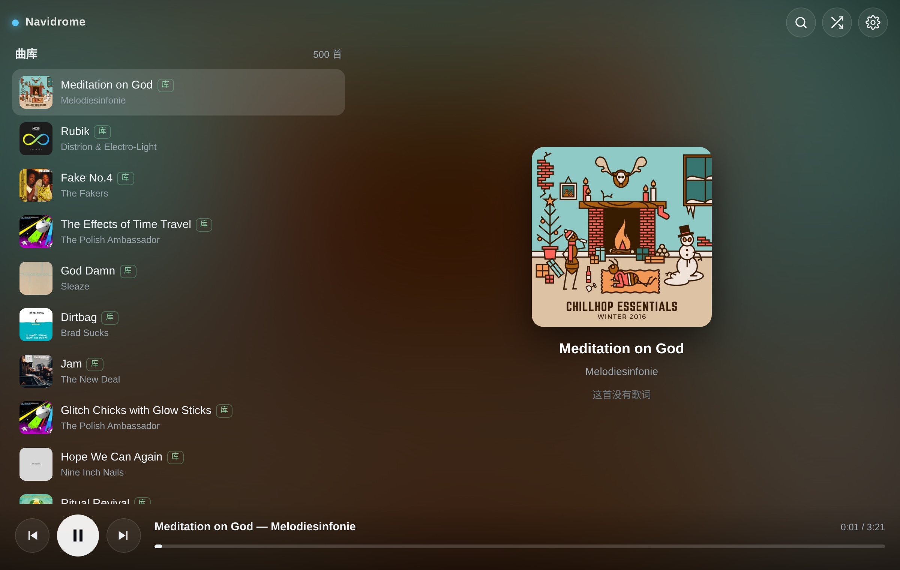
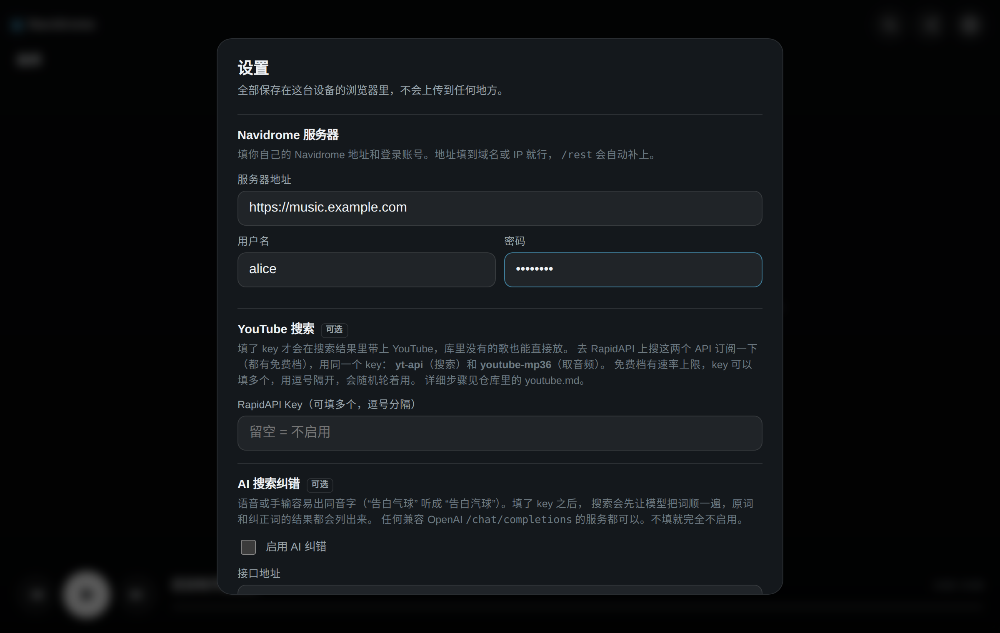

# navidrome-music-tesla

[English](README.md) · [中文](README.zh-CN.md)

A single-file web client for [Navidrome](https://www.navidrome.org/), built for in-car
browsers. One HTML file — no build step, no server-side component, no dependencies.



## Overview

- **Single file.** `index.html` contains all markup, styles and scripts. Nothing to compile
  and nothing to install.
- **No backend.** The page talks to your Navidrome server directly from the browser over the
  Subsonic API.
- **Designed for a car screen.** Large touch targets, tall list rows, a centred lyrics pane
  that scrolls itself, and album art used as the background.
- **Optional plugins** for YouTube search, AI query correction and a self-hosted search
  backend. All are disabled by default and issue no requests until configured.
- **Not tied to Tesla.** It was developed and tuned against the Tesla browser, but nothing in
  it is vehicle-specific. Any in-car, embedded or kiosk browser that meets the requirements
  below will run it — Android Automotive head units, aftermarket units, tablets mounted in a
  dash, or an ordinary desktop browser.
- **Light enough for weak hardware.** A single ~48 KB document, no framework and no runtime
  dependencies. See [Performance](#performance).

## Why a separate client

Navidrome ships a capable web UI, but it is laid out for desktop and phone use. On an in-car
display the controls are small relative to the viewing distance, list rows are dense, and
lyrics are presented as static text rather than as something that can be followed while
driving. This client trades browsing depth for legibility: fewer controls, larger hit areas,
and a lyrics view that tracks playback.

## Requirements

- A Navidrome server reachable from the car. The Subsonic API is enabled by default.
- A browser supporting `fetch`, `clip-path` and `IntersectionObserver`. Tested on Chrome,
  Edge, Safari and the Tesla in-car browser.
- HTTPS is recommended. A page served over HTTPS cannot call a plain-HTTP Navidrome server;
  browsers block that as mixed content.

## Installation

### Option 1 — use the hosted build

<https://jwsky.github.io/navidrome-music-tesla/>

Open it in the car's browser and bookmark it. This is the `index.html` from this repository
served as a static page by GitHub Pages. Your server address and credentials are stored in
your own browser and are never transmitted to the host — the page has no backend to send
them to.

### Option 2 — host it yourself

Download [`index.html`](index.html) and serve it from anywhere static:

- GitHub Pages, Cloudflare Pages, Netlify, or any object storage with static hosting
- Any directory served by the web server already running on the Navidrome host
- An internal nginx or Caddy instance

The file can also be opened directly from disk (`file://`), though some browsers restrict
`localStorage` in that context, which means settings may not persist.

## Configuration

Open the settings panel with the gear icon in the top-right corner.



All values are stored in `localStorage` on the device that entered them. There is no sync,
no account and no telemetry.

### Navidrome (required)

| Field | Notes |
| --- | --- |
| Server URL | Scheme and host, e.g. `https://music.example.com`. The `/rest` path is appended automatically; a trailing `/rest` is also accepted. |
| Username | Your Navidrome username. |
| Password | Your Navidrome password. |

Use **Test connection** to verify the settings before saving. On success it reports the
server type and version.

Authentication uses the Subsonic salt-and-token scheme: a random salt is generated for every
request and only `md5(password + salt)` is transmitted. The plaintext password is never put
in a URL, but it is kept in `localStorage` so that new salts can be derived. Treat any device
where you enter it as trusted.

#### Cross-origin requests

Navidrome returns `Access-Control-Allow-Origin: *` on the Subsonic API. That is what makes a
backend-free client possible: the page may be served from any origin and still call your
server directly. If Navidrome sits behind your own reverse proxy, make sure the proxy does
not strip or override that header.

### YouTube search (optional)

When configured, search results include YouTube entries alongside your library, so tracks
that are not in your collection can be played from the same interface. Audio is resolved to a
direct URL and played through the same `<audio>` element as local files — no embedded player
is used, so the progress bar, track skipping and keyboard shortcuts behave identically.

This plugin uses two third-party APIs hosted on RapidAPI, both with a free tier:

| API name | Purpose |
| --- | --- |
| `yt-api` | Search; returns the result list |
| `youtube-mp36` | Resolves a video to a playable audio URL |

Links are deliberately omitted — several similarly named APIs exist. Search for them by name
on RapidAPI and check the provider and current free-tier limits yourself.

**Setup**

1. Create a RapidAPI account.
2. Search for `yt-api`, open it and subscribe to the free plan.
3. Search for `youtube-mp36`, open it and subscribe to the free plan.
4. On either API page, copy the `X-RapidAPI-Key` value shown in the code samples.
5. Paste it into **Settings → YouTube search** and save.

The RapidAPI key is account-level, so a single key covers both APIs — but **each API must be
subscribed to separately**, otherwise calls are rejected with HTTP 403.

**Multiple keys.** Free plans are rate limited. Several keys may be entered, separated by
commas or newlines; one is chosen at random per request.

```
key-A, key-B
```

**Behaviour.** Library results are rendered first and remain visible while the YouTube
request is in flight. The resolver transcodes on demand, so the first play of a given track
may return a "processing" state; the interface reports this and retries for a few seconds.
YouTube entries have no lyrics — the artwork and title are shown instead.

**Troubleshooting**

| Message | Cause |
| --- | --- |
| `还没填 RapidAPI key` | The field is empty. |
| `RapidAPI 403` | Not subscribed to that API, or the key is wrong. Both APIs must be subscribed. |
| `RapidAPI 429` | Rate limit reached. Wait, or configure additional keys. |
| `YouTube 转码太久了` | The resolver stayed in the processing state. Try another result or retry later. |
| No YouTube results, no error | The key is empty, or the query genuinely returned nothing. |

**Compliance.** This plugin is disabled by default and ships with no credentials. It is
intended for personal use. The APIs it calls are operated by third parties with no
affiliation to this project or to YouTube, and downloading or extracting audio may conflict
with the YouTube Terms of Service or with local law depending on your jurisdiction and how
you use it. Enabling the plugin and supplying a key is your decision, and ensuring that your
use is lawful and compliant is your responsibility. This project hosts, caches, proxies and
redistributes no content whatsoever; all requests are made directly by your browser using
credentials you supply.

### AI query correction (optional)

Voice input and quick typing produce homophone errors — in Chinese, for example, 告白气球
easily becomes 告白汽球, which matches nothing. With this enabled, the query is first passed
to a language model for correction, and **results for both the original and the corrected
query are shown**. Nothing is replaced or discarded, so a bad correction does not cost you
the original results.

| Field | Notes |
| --- | --- |
| Enable | Off by default. |
| Endpoint | Any service exposing an OpenAI-compatible `/chat/completions`, e.g. `https://api.openai.com/v1`. |
| API key | Sent as `Authorization: Bearer`. |
| Model | Model identifier, e.g. `gpt-4o-mini`. |

One short completion is issued per search, capped at 40 output tokens. The key is stored in
`localStorage` and sent directly from the browser to the endpoint you configured.

### Self-hosted search backend (optional)

An additional source can be attached by pointing this field at a service that implements
three endpoints. See [docs/backend-api.md](docs/backend-api.md) for the contract. If a
backend supplies word-level lyric timings, the karaoke sweep described below is used.

## Lyrics

Navidrome serves embedded lyrics as well as `.lrc` files placed alongside the audio. Timed
lyrics are followed automatically: the active line is enlarged, centred and scrolled into
view.


When a source provides word-level timings, the active line is swept character by character.
Three layers are rendered per line — original text, romanisation and translation. If a
romanisation is present the type scale is inverted: the romanisation becomes the primary
line, the original is reduced to a reference line above it, and the sweep follows the
romanisation. Long lines wrap, and the sweep advances across the wrapped rows.

## Keyboard shortcuts

| Key | Action |
| --- | --- |
| Space | Play / pause |
| → | Next track |
| ← | Previous track |

## Performance

In-car browsers generally run on modest hardware and an unreliable connection, so the client
is built to stay cheap at runtime:

- One document, roughly 48 KB, parsed in a single pass. No framework, no bundler runtime, no
  external requests for code or fonts — the only network traffic is your own server's API,
  cover art and audio.
- The DOM stays small. Only the current lyric line carries the two-layer sweep markup;
  every other line is plain text.
- The karaoke sweep animates `clip-path` on a composited layer and reads no layout during
  playback — all glyph measurements are taken once when the line becomes active.
- Cover art is fetched only for rows scrolled into view, at 96 px. See the note below on why
  this matters more than it looks.
- Progress and lyric tracking run on a single 200 ms interval; the per-frame loop exists only
  while a swept line is actually playing.

## Notes on in-car browsers

- The Tesla browser is Chromium-based; ES6 and modern CSS are available. Other Chromium- or
  WebKit-based head units behave the same way.
- **Cover art is loaded on demand.** A library view can contain hundreds of rows, and
  requesting every thumbnail at once saturates the connection pool and starves the audio
  stream. Measured on a 500-track library: 12 seconds from tapping a track to audio starting.
  With an `IntersectionObserver` loading only visible rows, the same action starts audio in
  under 5 seconds. `loading="lazy"` alone was not sufficient.
- List thumbnails are requested at 96 px; the full-size image is fetched only for the
  background.
- The karaoke sweep is drawn with `clip-path` on a composited layer, so it does not trigger
  layout on every frame.
- Many vehicles, Tesla included, disable screen interaction while moving. That is a platform
  restriction, not a limitation of this page.

## Privacy

There is no backend, no analytics and no outbound reporting. Every request originates from
your browser and goes to a destination you configured: your Navidrome server, and — only if
you enable them — the third-party endpoints for the optional plugins. Settings, including
credentials and API keys, are held in `localStorage` on that device only.

## Browser support

Chrome, Edge, Safari and the Tesla in-car browser have been tested directly. Any reasonably
current Chromium- or WebKit-based browser should work; the requirements are `fetch`,
`clip-path` and `IntersectionObserver`, and the client degrades to eager image loading where
`IntersectionObserver` is unavailable.

## Roadmap

The following is not implemented yet and is listed here to describe the intended direction.

### Remote voice control via Apple Shortcuts

The goal is to request a track with Siri: an Apple Shortcut forwards the transcribed
utterance to the player, which searches for it and starts playback without anyone touching
the screen.

The blocker is **parsing natural speech**. What arrives is a full sentence such as
"play Sunny Day by Jay Chou" rather than a search term, so a model is needed to extract the
title and artist, strip filler words, and repair homophone errors introduced by speech
recognition. The implementation is expected to reuse the existing AI correction plugin, with
the [self-hosted backend](docs/backend-api.md) acting as the endpoint the Shortcut posts to.

Until then, the on-screen search box covers the same ground.

## Contributing

Issues and pull requests are welcome. The entire application is `index.html`; there is no
build tooling to set up — edit the file and reload the page.

## Disclaimer

This project is provided as-is under the MIT licence, with no warranty. It is a client for a
music server that you operate. You are responsible for holding the necessary rights to the
content you access through it and for ensuring that your use of any optional third-party
integration complies with that provider's terms and with the law in your jurisdiction.

## License

[MIT](LICENSE)
