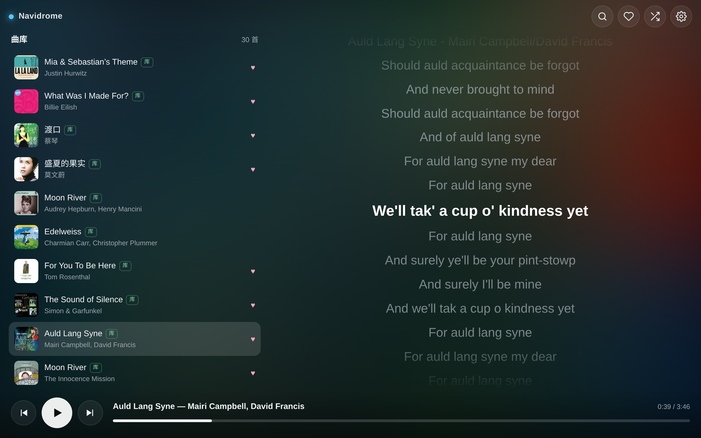
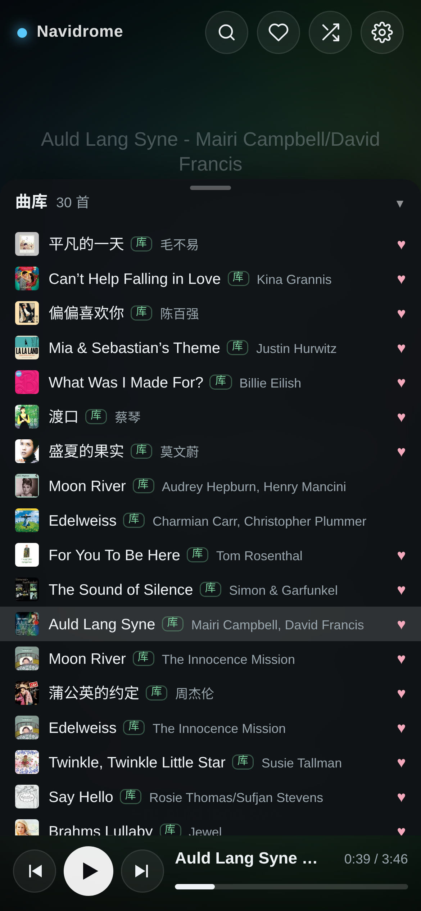
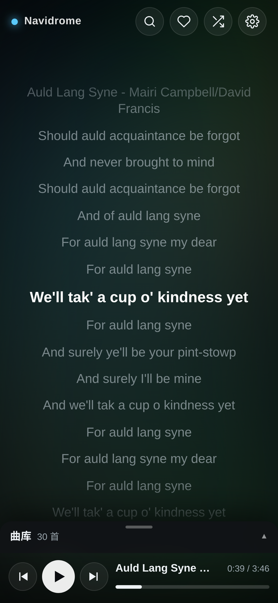
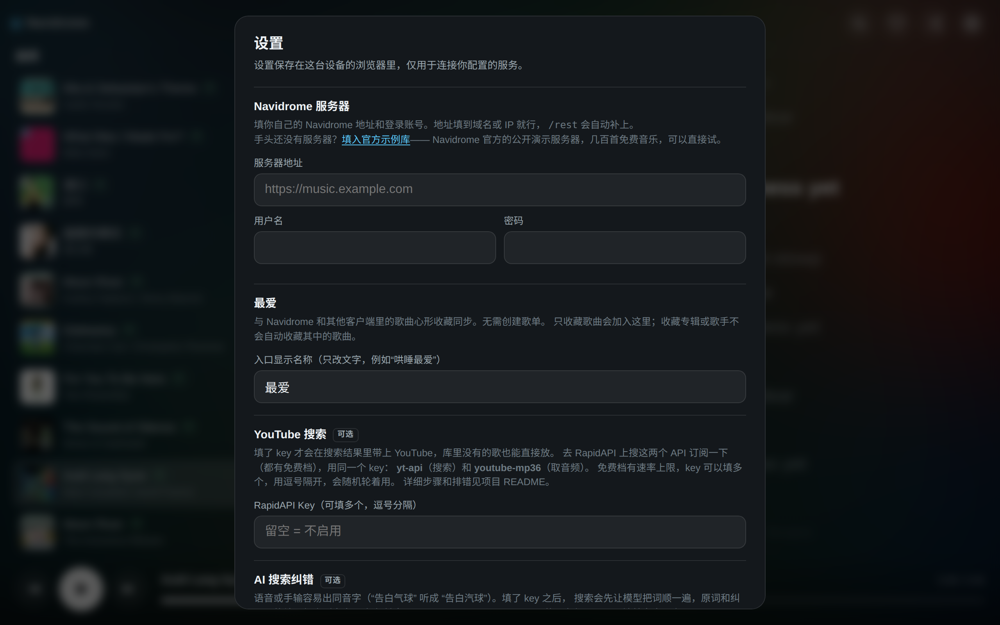
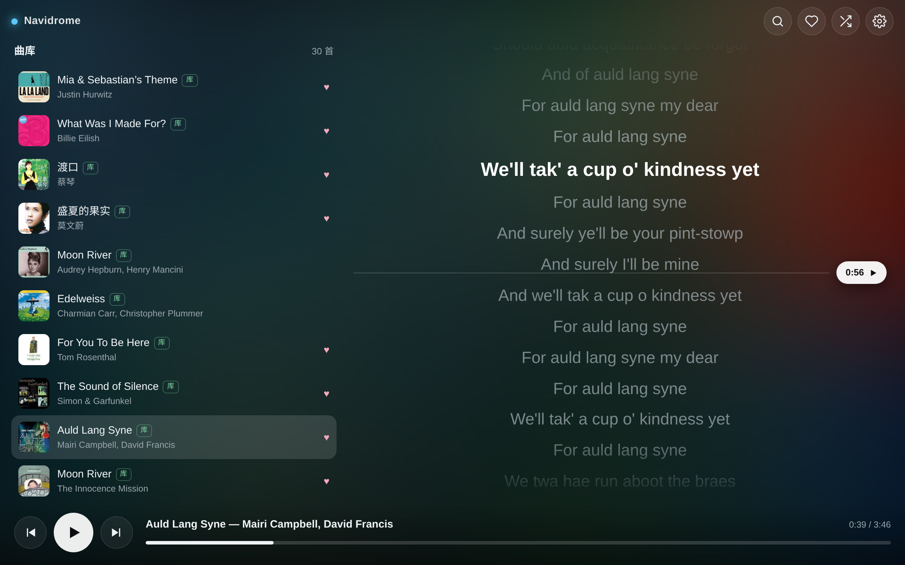

# navidrome-music-tesla

[English](README.md) · [中文](README.zh-CN.md)

面向车机、手机和电脑浏览器的 [Navidrome](https://www.navidrome.org/) 客户端。单个 HTML 文件——
无需构建、无需服务端、无外部依赖。



| 手机 · 列表展开 | 手机 · 列表收起 |
| --- | --- |
| <a href="docs/mobile-sheet.png"></a> | <a href="docs/mobile-player.png"></a> |

## 概述

- **单文件。** `index.html` 内含全部结构、样式与脚本，不需要编译，也不需要安装。
- **无后端。** 页面在浏览器中通过 Subsonic API 直接访问已有的 Navidrome 服务器，不需要再运行其他服务。
- **面向车机屏幕设计。** 触控目标更大、列表行更高、歌词居中且自动滚动，专辑封面作为背景。
- **手机布局。** 默认显示全屏歌词，上滑打开曲库，选歌后自动收起。播放控件始终留在底部，单手也方便操作。
- **可选插件**：YouTube 搜索、AI 搜索纠错、自建搜索后端。默认全部关闭，未配置前不发出任何请求。
- **最爱。** 心形按钮从本地缓存打开当前 Navidrome 账号的歌曲收藏，长按即可加入或取消，与其他客户端同步。
- **常听与发现。** 默认每 10 首包含按播放次数排序的下一批 7 首，以及 3 首播放较少的歌曲，曲库和最爱列表使用相同规则。
- **不限于特斯拉。** 开发与调优是在特斯拉车机浏览器上完成的，但实现本身不依赖任何车型特性。
  只要满足下文的前置条件，任意车机、嵌入式或 kiosk 浏览器都可运行——Android Automotive 车机、
  第三方后装主机、卡在中控的平板，乃至普通桌面浏览器。
- **对弱硬件友好。** 单个 HTML 文档，无框架、无运行时依赖。详见[性能](#性能)。

## 为什么单独做一个客户端

Navidrome 自带的 Web 界面功能完整，但版式面向桌面和手机。在车机屏幕上，控件相对观看距离偏小、
列表行密集，歌词也只是静态文本，难以在驾驶场景下跟随。本客户端用浏览深度换取可读性：控件更少、
点击区域更大、歌词跟随播放推进。

## 前置条件

- 一台车机可访问的 Navidrome 服务器（Subsonic API 默认启用）。
- 支持 `fetch`、`clip-path`、`IntersectionObserver` 的浏览器。已在 Chrome、Edge、Safari
  和特斯拉车机浏览器上测试。
- 建议使用 HTTPS。HTTPS 页面无法访问明文 HTTP 的 Navidrome，浏览器会按混合内容拦截。

## 安装

### 方式一：使用已托管的版本

<https://jwsky.github.io/navidrome-music-tesla/>

在车机浏览器中打开并收藏即可。该地址由 GitHub Pages 静态托管本仓库的 `index.html`。
服务器地址与账号密码保存在你自己的浏览器中，不会传输给托管方——页面本身没有后端可接收这些数据。

### 方式二：自行托管

下载 [`index.html`](index.html)，放到任意静态托管环境：

- GitHub Pages、Cloudflare Pages、Netlify，或任何支持静态托管的对象存储
- Navidrome 所在主机上已有 Web 服务的任意目录
- 内网的 nginx 或 Caddy

也可以直接以 `file://` 打开。部分浏览器在该场景下限制 `localStorage` 或跨域请求；如果设置无法保存
或连接被拦截，可以改用静态托管，仍然不需要应用服务端。

## 配置

点击右上角齿轮图标打开设置面板。



设置仅保存在填写它的这台设备的 `localStorage` 中，页面不另设账号，也没有遥测。
播放次数和歌曲收藏变更会发送给你的 Navidrome，方便其他客户端使用同一份数据。

### Navidrome（必填）

| 字段 | 说明 |
| --- | --- |
| 服务器地址 | 协议与主机，例如 `https://music.example.com`。`/rest` 会自动补上，已带 `/rest` 也可识别。 |
| 用户名 | Navidrome 用户名。 |
| 密码 | Navidrome 密码。 |

手头还没有自己的服务器？设置面板里有个**填入官方示例库**的链接，一键填好 Navidrome 官方
公开演示服务器并顺手测一次连接，可以先看看这个客户端是什么样子再决定要不要搭。
那台服务器由 Navidrome 项目提供、明确用于试用 Subsonic 客户端，里面有几百首自由授权的音乐，
设置项是只读的。

保存前可用**测试连接**验证，成功时会返回服务端类型与版本。

认证采用 Subsonic 的 salt+token 方式：每次请求生成随机 salt，只传输 `md5(密码 + salt)`，
明文密码不会出现在 URL 中。但为了持续派生新的 salt，明文密码会保存在 `localStorage` 里，
因此请只在你信任的设备上填写。

#### 跨域

Navidrome 的 Subsonic API 默认返回 `Access-Control-Allow-Origin: *`，这正是本客户端可以不带
后端的前提：页面无论部署在哪个域名下都能直接访问你的服务器。如果 Navidrome 位于你自己的反向代理
之后，请确认代理没有删除或覆盖该响应头。

### YouTube 搜索（可选）

配置后，搜索结果会在本地曲库之外一并列出 YouTube 条目，曲库中没有的歌也能在同一界面播放。
音频会被解析为直链，并通过与本地文件相同的 `<audio>` 播放——**不使用内嵌播放器**，因此进度条、
切歌和快捷键的行为与本地曲目完全一致。

该插件依赖托管在 RapidAPI 上的两个第三方 API，均有免费档：

| API 名称 | 用途 |
| --- | --- |
| `yt-api` | 搜索，返回结果列表 |
| `youtube-mp36` | 将视频解析为可播放的音频地址 |

此处刻意不提供链接——同名或近似名称的 API 不止一个，请在 RapidAPI 上按名称自行搜索，
并自行确认提供方与当前的免费额度。

**配置步骤**

1. 注册 RapidAPI 账号。
2. 搜索 `yt-api`，进入后订阅免费档。
3. 搜索 `youtube-mp36`，进入后订阅免费档。
4. 在任一 API 页面的代码示例中复制 `X-RapidAPI-Key`。
5. 粘贴到**设置 → YouTube 搜索**并保存。

RapidAPI 的 key 是账号级的，一个 key 即可覆盖两个 API，但**两个 API 必须分别订阅**，
否则调用会返回 HTTP 403。

**多个 key。** 免费档存在速率限制，可填写多个 key，以逗号或换行分隔，每次请求随机选用其一。

```
key-A, key-B
```

**行为说明。** 本地结果先行渲染，并在 YouTube 请求返回前保持可见。解析接口按需转码，
因此首次播放某个曲目可能返回「处理中」状态，界面会给出提示并重试数秒。
YouTube 条目没有歌词，此时右侧显示封面与标题。

**问题排查**

| 提示 | 原因 |
| --- | --- |
| `还没填 RapidAPI key` | 设置项为空。 |
| `RapidAPI 403` | 未订阅该 API，或 key 有误。两个 API 都需要订阅。 |
| `RapidAPI 429` | 触发速率限制。稍后再试，或配置更多 key。 |
| `YouTube 转码太久了` | 解析接口长时间处于处理中状态。换一条结果或稍后重试。 |
| 无 YouTube 结果且无报错 | key 为空，或该查询确实没有命中。 |

**合规说明。** 该插件默认关闭，且不附带任何凭据，仅面向个人使用场景。它所调用的 API 由第三方运营，
与本项目及 YouTube 均无关联；下载或提取音频在部分司法辖区可能与 YouTube 服务条款或当地法律相冲突，
具体取决于你所在地区及使用方式。是否启用该插件、是否提供 key 由你自行决定，
**确保使用行为合法合规是使用者自身的责任**。本项目不托管、不缓存、不代理、不分发任何内容，
所有请求均由你的浏览器使用你自己提供的凭据直接发出。

### AI 搜索纠错（可选）

语音输入和快速手输容易产生同音字错误，例如「告白气球」被写成「告白汽球」，直接搜索将没有结果。
启用后，查询会先交由语言模型纠正，并且**原始查询与纠正后查询的结果都会展示**，不替换、不丢弃，
即使模型纠错有误也不会导致原有结果丢失。

| 字段 | 说明 |
| --- | --- |
| 启用 | 默认关闭。 |
| 接口地址 | 任何提供 OpenAI 兼容 `/chat/completions` 的服务，例如 `https://api.openai.com/v1`。 |
| API Key | 以 `Authorization: Bearer` 方式发送。 |
| 模型 | 模型标识，例如 `gpt-4o-mini`。 |

每次搜索发起一次短补全请求，输出上限 40 token。Key 保存在 `localStorage`，
并由浏览器直接发送至你所配置的接口。

### 自建搜索后端（可选）

将该字段指向一个实现了三个接口的服务，即可接入额外音源，接口约定见
[docs/backend-api.md](docs/backend-api.md)。若该后端提供逐字歌词时间轴，
将启用下文所述的逐字扫光效果。

## 播放

选歌后开始播放。曲库歌曲在点击时直接发起播放，不等待加载事件；浏览器限制播放时会给出提示，
再点底部的 **播放** 即可重试。按钮图标跟随实际播放状态。

浏览器无法解码原始格式时，会向 Navidrome 请求一次最高 320 kbps 的 MP3 转码，
需要 Navidrome 已配置转码。播放权限错误不会触发转码；重试失败时会显示错误，仍可再次尝试或切歌。

## 手机上

手机默认进入歌词界面，曲库放在底部浮层里，收起时只露出标题条。文档开头的两张手机截图分别
展示列表展开与收起后的样式。

- **歌词看得更清楚。** 选歌后列表自动收起，把屏幕留给歌词，窄屏也能显示较大的文字。
- **一屏浏览更多歌曲。** 列表每行一首，封面、歌名和歌手放在同一行，减少反复滚动。
- **底部控件始终可见。** 播放条和曲库把手适应手机浏览器工具栏的展开、收起，不必滑动页面找按钮。
- **最爱切换快。** 首次同步后，心形按钮直接打开本地缓存；长按歌曲即可管理原生收藏。

手机、平板和车机使用同一个 HTML 文件，不需要安装 App，也不需要额外运行后端。

在标题条上向上滑——或者直接点它——浮层升起占据大半个屏幕；向下滑或选中一首就落回去。
快速一甩也算数，拖动距离不够则回弹，不会误切换。

列表一行一首（封面、歌名、来源角标、歌手都在同一行），一屏大约能看十七首。放不下的歌名可以
左右滑着看，右边缘只在真的还有内容时才淡出。

截图展示选取的曲库歌曲、真实专辑封面和同步歌词。播放示例为 Mairi Campbell 与 David Francis
演唱的 **Auld Lang Syne（友谊地久天长）**；展示的歌词片段来自 Robert Burns 的传统文本，
[美国国会图书馆将其标为公有领域](https://www.loc.gov/item/00001778/)。
录音和专辑封面的权利仍归各自权利人，截图不展示账号信息。
图片使用无损 PNG，桌面以 2 倍、手机以 3 倍像素渲染。点击图片可查看原始分辨率。

封面加载成功后才替换内置占位图，服务器慢或不可用时会保留占位图，不会留下空白图片。

## 最爱（Navidrome 原生收藏）

心形按钮打开当前 Navidrome 账号收藏的**歌曲**，读取 `getStarred2.song`。不需要创建名为
`宝宝哄睡`、`Favorites` 或其他名称的歌单，也不需要额外后端。其他 Navidrome 客户端的歌曲心形
会同步到这里；收藏专辑或歌手不会自动收藏其全部歌曲。

1. 配置自己的 Navidrome 账号。
2. 长按曲库歌曲，或在电脑上右键 / Shift+F10。
3. 点击 **加入最爱**，页面通过原生 `star` 接口收藏，并读回确认。
4. 点击 **取消最爱**，通过原生 `unstar` 解除收藏，原文件、普通歌单和当前播放保持原状。

**设置 → 最爱 → 入口显示名称** 只改入口文字，例如“哄睡最爱”；它不会按名字选择歌单、筛选哄睡歌曲，
也不会改变收藏范围。每个账号只有一份歌曲收藏，收藏普通歌曲也会进入这个集合。若需要互相独立的
哄睡、儿歌和流行歌曲列表，在 Navidrome 建立普通歌单即可。

**在 Navidrome 的歌单列表里也显示最爱。** 官方智能歌单可以自动汇总歌曲心形。
将下面内容保存为音乐目录中的 `最爱.nsp`，然后扫描曲库：

```json
{
  "name": "最爱",
  "all": [{"is": {"loved": true}}],
  "sort": "playCount",
  "order": "desc"
}
```

歌单所有者应为需要汇总收藏的账号；首次导入默认归第一个管理员所有。
访问时自动刷新，内容随歌曲收藏或取消收藏变化。本客户端仍直接读取原生收藏，不依赖这个歌单。
详见 [Navidrome 智能歌单文档](https://www.navidrome.org/docs/usage/features/smart-playlists/)。

缓存按服务器和用户名隔离，与入口显示名称无关。点击心形直接打开本机快照；首次使用先完成后台同步。
每五分钟同步一次，回到页面且距离上次同步超过一分钟时也刷新；读取失败保留上次快照。
缓存只有歌曲信息，封面和音频仍从 Navidrome 加载。更换账号不会沿用上一个账号的收藏。

**旧版本迁移。** 旧客户端的“收藏到哄睡歌单”其实是普通歌单条目，不是原生收藏。
升级不会删除或自动改写那些歌单。打开自己的旧歌单，在 Navidrome 给其中需要保留的歌曲点心形，
或选中多首后收藏；也可以在本客户端长按逐首加入最爱。已有原生收藏会保留。

[Navidrome 收藏说明](https://www.navidrome.org/docs/overview/) ·
[原生 getStarred2 接口](https://opensubsonic.netlify.app/docs/endpoints/getstarred2/)

**挑选哄睡歌曲。** 最爱视图中的 **从曲库挑选** 会从你自己的曲库筛选候选，依据歌名、专辑名和曲风标签
匹配摇篮曲、常见舒缓歌曲及安静的钢琴作品。支持中英文和纯音乐，例如《雪绒花》《平凡的一天》、
*Mia & Sebastian's Theme*。这是元数据筛选，不是音频分析；同名歌曲的版本和编曲也可能不同，
请试听后再长按收藏。页面不会自动加入、下载或购买歌曲，仓库也不附带音乐或私人歌单。

**删除原始文件。** 菜单中此项显示为不可用。本页面使用的
[标准 Subsonic API](https://opensubsonic.netlify.app/docs/endpoints/) 没有删除曲库音频文件的接口。
要删除原始文件，请使用管理音乐目录的工具，再让 Navidrome 重扫；解除歌单收藏是另一项操作。
本客户端不会额外安装文件管理服务。

## 默认排序与播放次数

曲库和最爱采用相同的默认排序。每完整 10 首包含按 Navidrome 的 `playCount` 排序的下一批 7 首，
以及从播放较少的部分选出的 3 首发现曲目。位置依次为 **常听、常听、常听、发现、常听、常听、发现、
常听、常听、发现**，不会重复。同次数先比较最近播放时间，再比较入库时间；同一次打开页面内，
发现曲目的顺序保持稳定，刷新页面后重新抽取。排序按钮可切换曲库的 **最近添加** 与默认排序。

排序全部在浏览器中计算。曲库信息分页读取，超过 500 首的收藏也会完整载入；搜索结果保持搜索顺序，
不套用这套混排规则。

曲库歌曲实际听过的片段累计达到 **半首或四分钟，取较短者** 时，页面向 Navidrome 上报一次 `scrobble`。
把进度条拖过 50% 不会把跳过的部分算进去，暂停时间也不计入；同一轮播放反复听同一个片段，
不会重复计算该片段。重新加载一首歌曲会开启新的一轮。上报成功后读取 Navidrome 的最新次数，
YouTube 或其他插件歌曲不会冒充曲库播放来上报。上报需要网络连接，不会排队补报或自动重试结果未知的
请求。其他客户端记录的次数仍取决于各自的统计规则。

## 歌词

Navidrome 支持内嵌歌词，也支持与音频文件同目录的 `.lrc`。带时间戳的歌词会自动跟随：
当前行放大、居中并滚动到视野中央。



当音源提供逐字时间轴时，当前行会逐字扫光。每行渲染三层——原文、罗马音、翻译。
若存在罗马音，字号层级会反转：罗马音成为主行，原文缩小为其上方的对照行，扫光跟随罗马音。
长行会自动折行，扫光会跨行依次推进。

### 拖歌词跳转

拖动歌词会暂停自动跟随，并在正中间显示一条准星线和该位置的时间。**拖动本身不会跳转**——
手指划过去就跳太容易误触——只有点了那个按钮才真正 seek。最后一次滑动几秒后自动恢复跟随，
跳转后立即恢复。

## 快捷键

| 按键 | 操作 |
| --- | --- |
| 空格 | 播放 / 暂停 |
| → | 下一首 |
| ← | 上一首 |

## 性能

车机浏览器通常运行在性能有限的硬件和不稳定的网络上，因此本客户端在运行时开销上做了控制：

- 单个 HTML 文档，一次解析完成。无框架、无打包器运行时，也不外部加载代码或字体——
  网络流量只有你自己服务器的 API、封面和音频。
- DOM 保持精简。只有当前歌词行带双层扫光结构，其余行都是纯文本。
- 逐字扫光在合成层上动画 `clip-path`，播放期间不读取布局——所有字形位置在该行成为当前行时
  一次性测完。
- 封面仅对滚动进入视野的行发起请求，且只取 96 px。为什么这件事比看上去重要，见下方说明。
- 进度与歌词跟随由单个 200 ms 定时器驱动；逐帧循环只在确实有扫光行播放时才存在。

## 车机浏览器相关说明

- 特斯拉车机浏览器基于 Chromium，ES6 与现代 CSS 均可用。其他基于 Chromium 或 WebKit 的车机
  表现一致。
- **封面按需加载。** 曲库列表可能有数百行，一次性请求全部缩略图会占满连接池并使音频流被饿死。
  在 500 首的曲库上实测：点击曲目到开始出声需要 12 秒；改用 `IntersectionObserver`
  只加载可见行后，同样操作在 5 秒内出声。仅靠 `loading="lazy"` 不足以解决该问题。
- 列表缩略图按 96 px 请求，仅背景使用大图。
- 逐字扫光使用 `clip-path` 在合成层上绘制，不会在每帧触发布局。
- 包括特斯拉在内，不少车型会在行驶过程中禁用屏幕交互，这是平台限制，与本页面无关。

## 隐私

本项目没有应用服务端，也没有使用分析。所有请求均由你的浏览器发出，目标也仅为你自行配置的地址：
你的 Navidrome 服务器，以及——仅在你启用时——可选插件所对应的第三方接口。
包括凭据与 API Key 在内的全部设置仅保存在该设备的 `localStorage` 中，最爱缓存也保存在本机。
歌曲收藏变更和达到统计条件的播放时间戳会发送给你的 Navidrome。仓库不附带配置导出或私人歌单。

静态页面无法向正在使用它的浏览器隐藏密钥。请在设置中填写自己的 Key，不要写入 `index.html`，
也不要发布包含已填写凭据的浏览器存储、网络抓包或截图。

## 浏览器支持

已直接测试的环境为 Chrome、Edge、Safari 及特斯拉车机浏览器。任何较新的 Chromium 或 WebKit
内核浏览器均应可用；所需特性为 `fetch`、`clip-path` 与 `IntersectionObserver`，
在缺少 `IntersectionObserver` 的环境下会退回为立即加载图片。

## 本地部署与 GitHub 版

收藏机制完全相同：`getStarred2.song` + `star/unstar`，两端默认入口都叫“最爱”。入口显示名可以自行修改，连接配置按部署设置。公开版不附带家庭歌曲、歌单 ID 或账号，删除原始文件仍需要音乐库的管理工具。详见[开发约定与版本差异](docs/development.zh-CN.md)。

## 开发计划

以下功能尚未实现，列在此处说明方向。

### 通过苹果快捷指令进行远程语音控制

目标是用 Siri 直接点歌：通过一条「快捷指令」把语音识别出的整句话发给播放器，
车机端接收后自动搜索并播放，无需在屏幕上打字。

尚未实现的主要原因在于**自然语句的解析**——用户说出的是「放一首周杰伦的晴天」这类完整句子，
而不是检索词，需要模型从中抽取歌名与歌手、去除口语填充词，并处理语音识别产生的同音字。
这部分预计会复用现有的 AI 纠错插件，并依托[自建搜索后端](docs/backend-api.zh-CN.md)
承载快捷指令的接收端。

在此之前，屏幕上的搜索框可以正常使用。

## 参与贡献

欢迎提交 issue 与 pull request。整个应用即 `index.html`，没有构建工具链需要配置——
直接编辑文件并刷新页面即可。

缓存和排序测试使用 Node 自带的测试运行器：`node --test tests/*.test.cjs`。
不需要构建应用，也不增加应用运行时依赖。

## 免责声明

本项目基于 MIT 许可以现状提供，不附带任何担保。它是一个用于访问**你自己运营的**音乐服务器的客户端。
你需要自行确保拥有访问相应内容的权利，并确保对任何可选第三方集成的使用符合该服务提供方的条款
以及你所在司法辖区的法律。

## 许可

[MIT](LICENSE)
